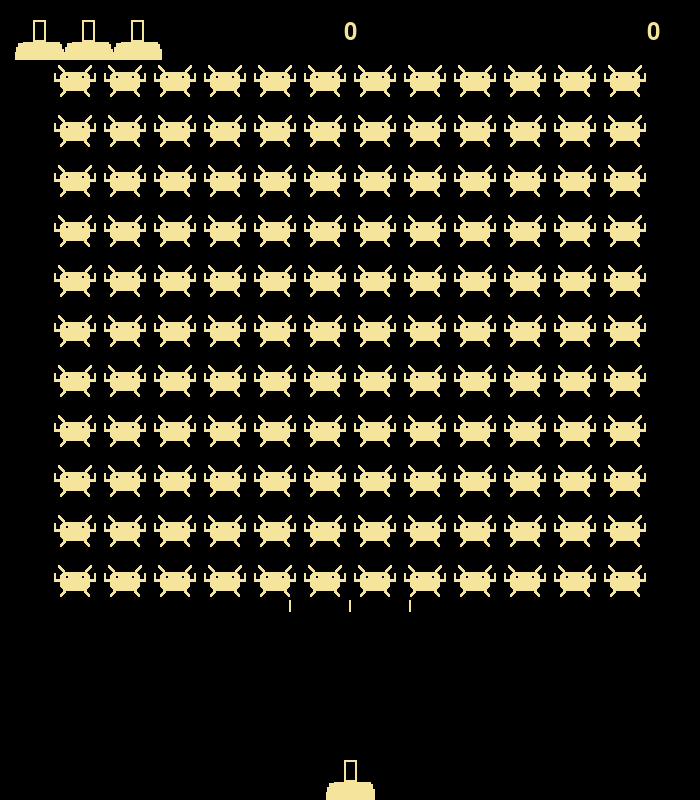

# 🚀 Space Game (Космические войны)

**🇬🇧 [English](#english) · 🇷🇺 [Русский](#русский)**

<p align="center">
  
</p>

---

## English

An arcade shooter in the style of *Space Invaders*, written in Python with **pygame**. You control a laser gun at the bottom of the screen, shoot down the descending aliens and rack up points. The project is split into modules, each responsible for its own part of the game.

### 🎮 Features
- Gun control: move left/right (`A` / `D`), shoot (`Space`)
- A fleet of aliens descending toward the player
- Points for kills, a 3-lives system
- **Persistent high score across runs** (stored in the `Best record` file)
- A new wave of aliens after the screen is cleared

### 🚀 Run
```bash
pip install pygame
cd "Space Game"
python "space game.py"
```

### 📂 Architecture: split into modules
Each file has a single responsibility:

| Module | Responsibility |
|--------|----------------|
| `space game.py` | Entry point, main game loop |
| `controls.py` | Event handling, object updates, collisions |
| `gun.py` | Player gun class |
| `bullet.py` | Bullet class |
| `aliens.py` | Alien class |
| `statistics.py` | Score, lives, record |
| `rating.py` | Drawing score, record and lives on screen |

### 🔑 Key technical highlights

**1. pygame sprites and groups.** Gun, bullets and aliens inherit from `pygame.sprite.Sprite` and are managed via `Group`, which gives group drawing, updating and — most importantly — collision detection for free.

**2. Collisions via `groupcollide` and `spritecollideany`.** Instead of manual loops, pygame built-ins are used:
```python
collisions = pygame.sprite.groupcollide(bullets, aliens, True, True)  # both removed
if pygame.sprite.spritecollideany(lazer_gun, aliens):                 # alien touched gun
    lazer_gun_kill(...)
```

**3. Automatic fleet building.** The number of rows and columns is computed from the screen and sprite sizes — the fleet fills the field by itself, with no magic numbers tied to a fixed resolution.

**4. Smooth movement via float coordinates.** Positions are kept as `float` (`self.center`, `self.y`) and written into the integer-only `rect` at the last moment — enabling smooth sub-pixel speed, a classic pygame arcade trick.

**5. High score saved to disk.** The best score survives a restart: read from `Best record` on start, rewritten on every new record.
```python
def check_best_score(statistics, score):
    if statistics.score > statistics.best_score:
        statistics.best_score = statistics.score
        with open('Best record', 'w') as f:
            f.write(str(statistics.best_score))
```

**6. Lives reuse the gun sprite.** The lives indicator is drawn with the same `Gun` sprites as the player — the icons automatically match the player's look.

**7. Off-screen bullet cleanup.** Bullets that fly past the top are removed from the group so they don't pile up in memory.
```python
for bullet in bullets.copy():
    if bullet.rect.bottom <= 0:
        bullets.remove(bullet)
```

### 🛠️ Tech
**Python 3** · **pygame** (graphics, sprites, collisions, input) · file I/O for the record

---

## Русский

Аркадный шутер в стиле *Space Invaders* на Python и **pygame**. Управляешь лазерной пушкой внизу экрана, отстреливаешь приближающихся пришельцев и набираешь очки. Проект разбит на модули — каждый отвечает за свою часть игры.

### 🎮 Возможности
- Управление пушкой: движение влево/вправо (`A` / `D`), стрельба (`Пробел`)
- Флот пришельцев, спускающийся к игроку
- Очки за уничтожение, система из 3 жизней
- **Сохранение рекорда между запусками** (в файл `Best record`)
- Новая волна пришельцев после зачистки экрана

### 🚀 Запуск
```bash
pip install pygame
cd "Space Game"
python "space game.py"
```

### 📂 Архитектура: разделение по модулям
Каждый файл со своей зоной ответственности:

| Модуль | Ответственность |
|--------|-----------------|
| `space game.py` | Точка входа, главный игровой цикл |
| `controls.py` | Обработка событий, обновление объектов, столкновения |
| `gun.py` | Класс пушки игрока |
| `bullet.py` | Класс пули |
| `aliens.py` | Класс пришельца |
| `statistics.py` | Счёт, жизни, рекорд |
| `rating.py` | Отрисовка счёта, рекорда и жизней |

### 🔑 Ключевые технические решения

**1. Спрайты и группы pygame.** Пушка, пули и пришельцы наследуются от `pygame.sprite.Sprite` и управляются через `Group` — это даёт «бесплатно» групповую отрисовку, обновление и проверку столкновений.

**2. Столкновения через `groupcollide` и `spritecollideany`.** Вместо ручного перебора — встроенные функции pygame:
```python
collisions = pygame.sprite.groupcollide(bullets, aliens, True, True)  # обе стороны удаляются
if pygame.sprite.spritecollideany(lazer_gun, aliens):                 # пришелец дотронулся до пушки
    lazer_gun_kill(...)
```

**3. Автоматическое построение флота.** Количество рядов и столбцов рассчитывается из размеров экрана и спрайта — флот заполняет поле сам, без «магических чисел» под конкретное разрешение.

**4. Плавное движение через float-координаты.** Позиции хранятся как `float` (`self.center`, `self.y`), а в целочисленный `rect` пишутся в последний момент — это даёт плавное движение с дробной скоростью, типичный приём аркад на pygame.

**5. Сохранение рекорда на диск.** Лучший счёт переживает перезапуск: при старте читается из `Best record`, при новом рекорде сразу перезаписывается.
```python
def check_best_score(statistics, score):
    if statistics.score > statistics.best_score:
        statistics.best_score = statistics.score
        with open('Best record', 'w') as f:
            f.write(str(statistics.best_score))
```

**6. Жизни как переиспользование спрайта пушки.** Индикатор жизней рисуется теми же спрайтами `Gun`, что и сама пушка, — иконки автоматически совпадают с видом игрока.

**7. Очистка пуль за пределами экрана.** Улетевшие вверх пули удаляются из группы, чтобы не копиться в памяти.
```python
for bullet in bullets.copy():
    if bullet.rect.bottom <= 0:
        bullets.remove(bullet)
```

### 🛠️ Технологии
**Python 3** · **pygame** (графика, спрайты, столкновения, ввод) · работа с файлом для рекорда

---
*Учебный проект для практики ООП, модульной архитектуры и системы спрайтов pygame. / Educational project for practising OOP, modular architecture and the pygame sprite system.*
